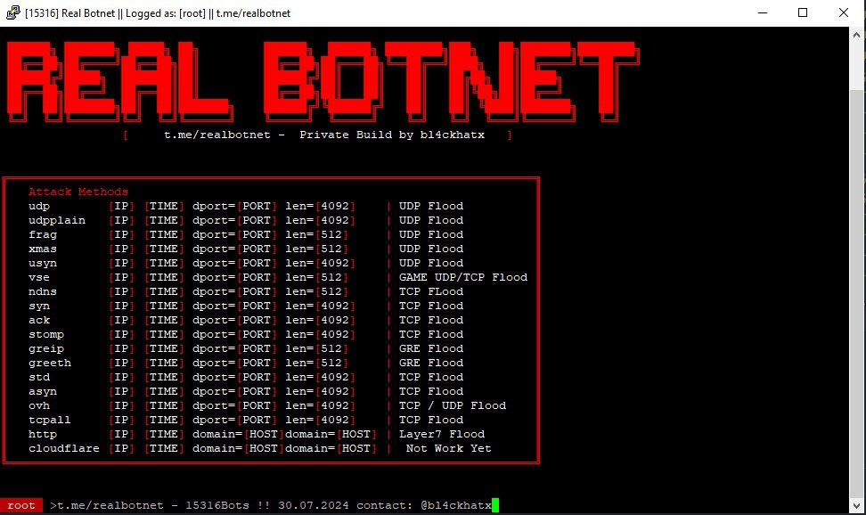

<h1 align="left">Hey 👋 Welcome to Real Botnet - Informations</h1>

###

Discover our official channel for real botnet and Nextgen Layer 4 & Layer 7 C2 Botnet method, Mirai, API stresser testing, DDoS, and bypass techniques. Join us now!  Contact: @bl4ckhatx  

  

###

  

###

<h2 align="left">🎯 Attack Methods Listed - t.me/realbotnet 💢</h2>

###

udp: UDP Flood - Overloads a target with UDP packets. udpplain: UDP Flood - Another variant of the UDP flood. frag: UDP Flood - Possibly fragments UDP packets to evade detection. xmas: TCP Flood - Uses TCP "XMAS" packets that have unusual flag settings. usyn: SYN Flood - Targets the TCP connection process by sending SYN packets. vse: GAME UDP/TCP Flood - Specifically targets game servers. ndns: TCP Flood - Could be a DNS-based flood attack. syn: SYN Flood - Same as "usyn," targeting TCP connections. ack: TCP Flood - Uses ACK packets for the flood. stomp: TCP Flood - Another TCP flood, details unclear. greip: GRE Flood - Targets GRE (Generic Routing Encapsulation) traffic. greeth: GRE Flood - Another variant of GRE flood. std: STD Flood - A standard flood, details unclear. asyn: TCP Flood - An asynchronous variant of the TCP flood. ovh: TCP / UDP Flood - A combined TCP/UDP attack. tcpall: TCP Flood - Targets all TCP ports. http: Layer7 Flood - Targets HTTP services with a high number of requests. cloudflare: Not working - Cloudflare is not functional yet.

###

<h2 align="left">Private Build by bl4ckhatx - Mirai botnet t.me/realbotnet</h2>

###

###

  

###
